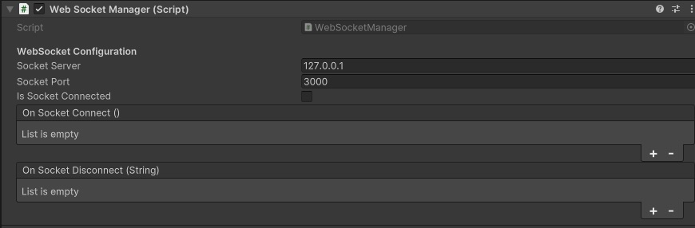
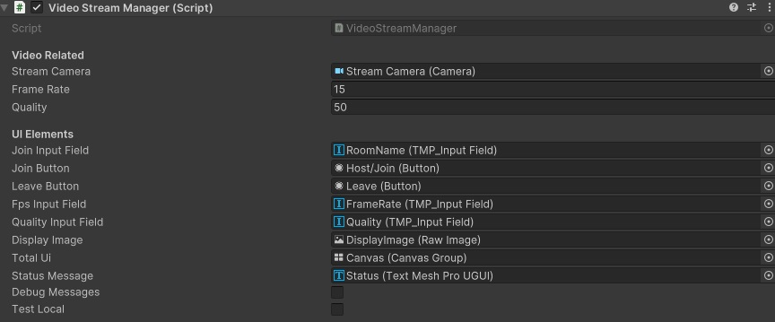

# WebSocket Broadcast System using Unity and NodeJS 

This project is a **WebSocket-based system** that allows users to create or join broadcasts, send and receive messages in real-time, and manage broadcasts. It consists of two main components:
1. A **Unity client** that manages WebSocket connections and interactions.
2. A **Node.js WebSocket server** that handles broadcasts and clients.


## Features
- **Create and Host Broadcasts**: Users can create and host broadcasts. The host can stream data to connected clients.
- **Join Broadcasts**: Other users can join the existing broadcasts as participants.
- **Real-time Streaming**: The host can stream data to all participants in real-time.
- **WebSocket Management**: Handles connection events, errors, and disconnections gracefully.

## Requirements
- Unity 2021.1 or higher.
- Newtonsoft.Json for Unity (included in Unity package manager).
- Node.js v14+.
- ws and uuid npm packages.

## Components
### 1. Unity WebSocket Client
This component allows a Unity game or application to connect to a WebSocket server, send/receive messages, and manage real-time events.

#### Key Files:
- **WebSocketManager.cs**: 
  - Manages WebSocket connections and provides methods for sending and receiving messages.
  - Handles subscribing to events and processing responses from the server.



- **VideoStreamManager.cs**:
  - Handles the logic for creating, joining, and leaving broadcasts.
  - Manages sending data from the Unity client to the WebSocket server for broadcasting.

#### Unity Client Setup:
1. Add the `WebSocketManager` script to a GameObject in your Unity scene.
2. Configure the WebSocket server details (IP and port) in the Unity inspector.
3. Use the `VideoStreamManager` to create, join, or leave broadcasts.

### 2. WebSocket Server (Node.js)
The WebSocket server allows clients to create or join broadcasts and handles data streaming between clients.

#### Key Files:
- **server.js**:
  - Main WebSocket server file built using `ws` library.
  - Uses `uuid` to generate unique client IDs and broadcast IDs.
  - Manages multiple broadcasts, handles client connections, disconnections, and message streaming.

#### Server Setup:
1. Install dependencies:
    ```bash
    npm install ws uuid
    ```
2. Run the WebSocket server:
    ```bash
    node server.js
    ```
3. The server will start on `ws://localhost:3000`.

#### Server Functions:
- **Create Broadcast**: A client can create a new broadcast room, becoming its host.
- **Join Broadcast**: Other clients can join an existing broadcast.
- **Stream Data**: The host can stream data to all participants of the broadcast.
- **Handle Disconnections**: When a host disconnects, all participants are notified, and the broadcast is cleaned up.

## How to Use
1. **Run the WebSocket Server**:
    - Start the WebSocket server by running `node server.js`. The server will listen on port `3000`.
    - The server will manage multiple broadcast sessions and relay messages between participants.

2. **Unity Client Setup**:
    - Clone the Unity project and open it in Unity.
    - Set the WebSocket server IP and port in the `WebSocketManager` component in the Unity Editor.
    - Create a scene and add a GameObject with the `WebSocketManager` and `VideoStreamManager` scripts attached.
    - Run the Unity project to connect to the WebSocket server and create or join broadcasts.

3. **Create or Join Broadcast**:
    - Use the Unity interface (UI buttons, for example) to create or join a broadcast.
    - If you are the host, stream data to all participants.
  
## Example Flow
1. **Client 1** starts the Unity application and creates a broadcast.
2. **Client 2** joins the broadcast using the broadcast ID.
3. **Client 1 (Host)** starts streaming data, and **Client 2** receives the streamed content in real-time.
4. If **Client 1** (Host) disconnects, the broadcast session is closed, and **Client 2** is notified of the disconnection.

## Project Structure
```bash
/ProjectRoot
│
├── /UnityClient
│   ├── WebSocketManager.cs   // Manages WebSocket communication
│   ├── VideoStreamManager.cs   // Manages creating and joining broadcasts
│   └── ...                   // Unity project files
│
├── /Server
│   ├── StreamServer.js             // WebSocket server handling broadcasts and clients
│   └── package.json          // Dependencies (ws, uuid)
│
└── README.md                 // Project documentation
